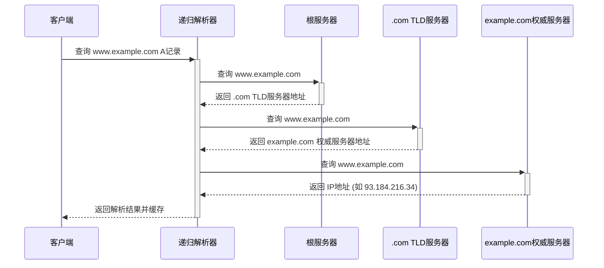
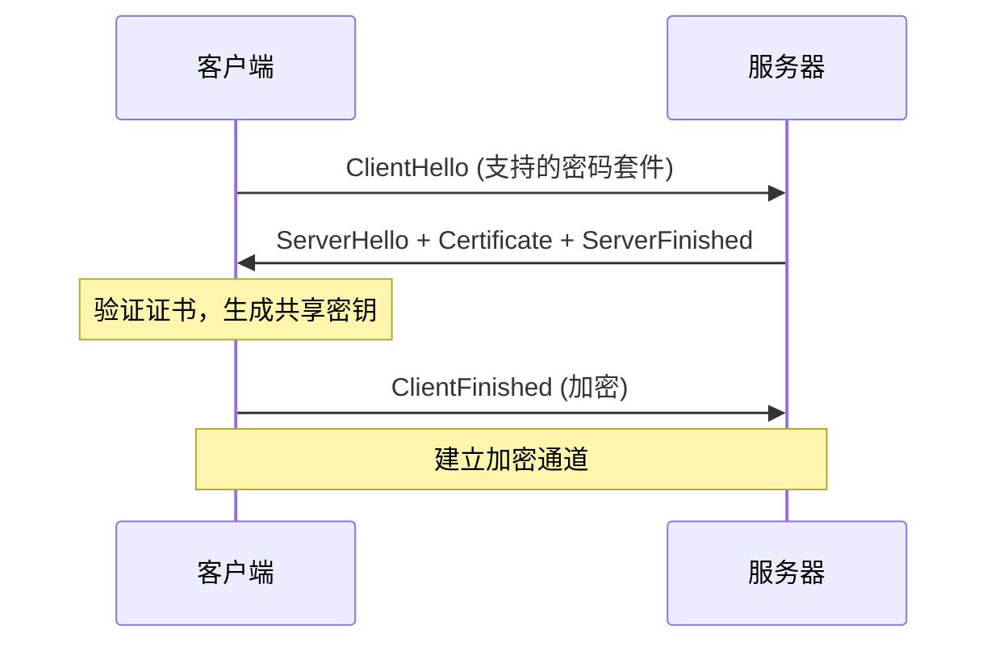
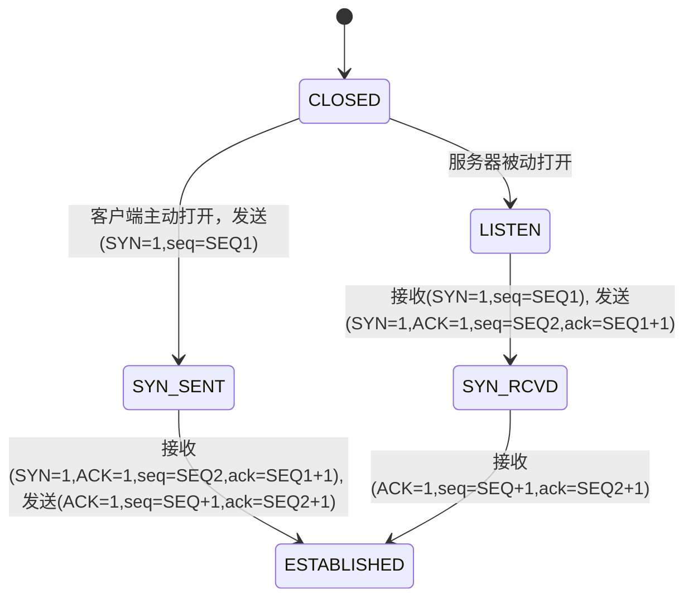
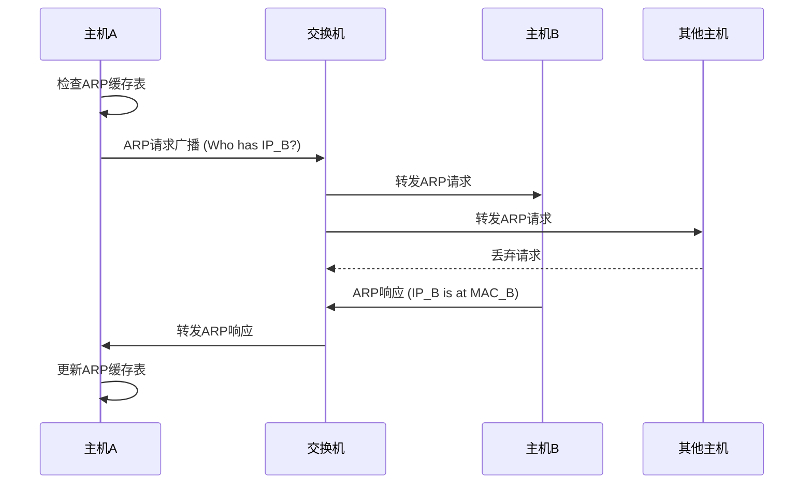
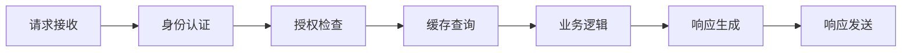
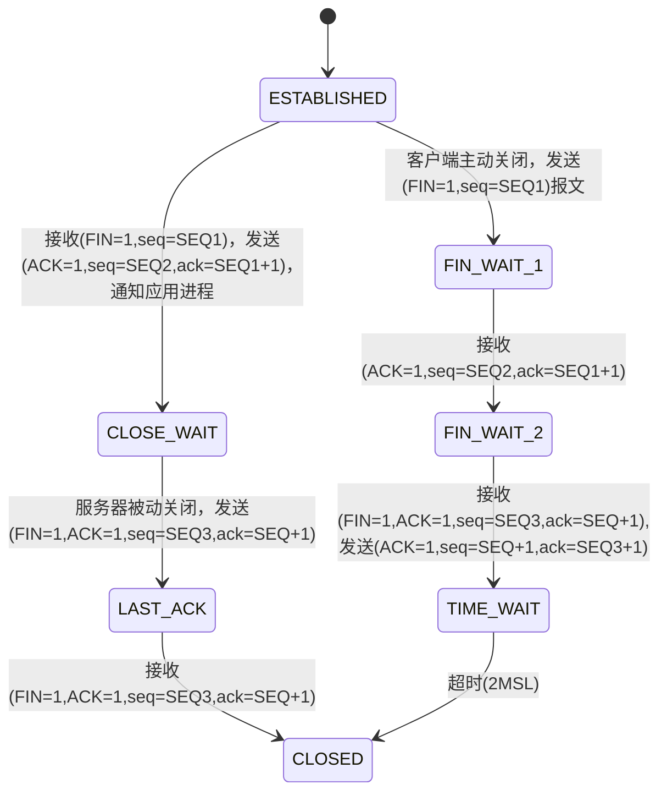

# 网页加载过程的技术解析：从URL到页面渲染的完整流程

## 摘要

当用户在浏览器地址栏输入URL并按下回车键时，一个复杂的网络通信过程随即启动。本文将系统性地分析从URL解析到网页完整渲染的全过程，深入剖析协议栈各层的协同工作机制，呈现现代互联网通信的技术架构。

## 1 应用层协议与资源定位

### 1.1 URL

统一资源定位符（Uniform Resource Locator, URL）是互联网资源的标准化寻址方案。其标准语法结构如下：

```
scheme://[userinfo@]host[:port]/path[?query][#fragment]

https://www.example.com:1211/index.html?k1=v1&k2=v2
```

**核心组件分析：**

- **协议标识符（Scheme）**：定义应用层协议类型，常见协议包括HTTP（HyperText Transfer Protocol）、HTTPS（HTTP Secure）、FTP（File Transfer Protocol）等
- **主机标识符（Host）**：可采用域名（Domain Name）或IPv4/IPv6地址格式
- **端口号（Port）**：TCP/UDP端口标识符，HTTP默认端口80，HTTPS默认端口443
- **资源路径（Path）**：服务器端文件系统的相对路径
- **查询参数（Query String）**：键值对格式的参数传递机制，使用URL编码规范

### 1.2 DNS

#### 1.2.1 DNS层次化架构

DNS采用分布式层次化数据库架构，具有以下层级结构：

1. **根域名服务器（Root Name Servers）**：全球13个逻辑根服务器集群，负责顶级域名服务器的权威应答，提供顶级域名服务器的IP地址。
2. **顶级域名服务器（TLD Servers）**：管理特定顶级域名（如`.com`、`.org`、`.edu`）的权威数据
3. **权威域名服务器（Authoritative Name Servers）**：负责特定域名的最终解析
4. **递归域名服务器（Recursive Resolvers）**：互联网服务提供商（Internet Servise Provider, ISP）提供的本地缓存服务器，执行迭代查询

#### 1.2.2 DNS解析的迭代查询流程

以查询`www.example.com`的A记录为例：



### 1.3 HTTP协议报文结构

#### 1.3.1 HTTP请求报文格式

HTTP请求报文遵循RFC 7230标准，采用ASCII文本格式：

```http
GET /index.html HTTP/1.1
Host: www.example.com
User-Agent: Mozilla/5.0 (Windows NT 10.0; Win64; x64) AppleWebKit/537.36
Accept: text/html,application/xhtml+xml,application/xml;q=0.9,*/*;q=0.8
Accept-Language: zh-CN,zh;q=0.8,en-US;q=0.5,en;q=0.3
Accept-Encoding: gzip, deflate, br
Connection: keep-alive
Cache-Control: max-age=0

[请求体]
```

**关键头部字段：**
- **Host**：虚拟主机标识，支持单IP多域名部署
- **User-Agent**：客户端标识字符串
- **Accept系列**：内容协商机制
- **Connection**：连接管理（keep-alive/close）

#### 1.3.2 HTTP响应报文格式

```http
HTTP/1.1 200 OK
Date: Wed, 13 Aug 2025 12:00:00 GMT
Server: Apache/2.4.41
Content-Type: text/html; charset=UTF-8
Content-Length: 1234
Content-Encoding: gzip
Cache-Control: max-age=3600
ETag: "abc123"

<!DOCTYPE html>
<html>...
```

**状态码分类：**
- **1xx**：信息性状态码
- **2xx**：成功状态码（200 OK, 201 Created）
- **3xx**：重定向状态码（301 Moved Permanently, 302 Found）
- **4xx**：客户端错误（400 Bad Request, 404 Not Found）
- **5xx**：服务器错误（500 Internal Server Error, 503 Service Unavailable）

### 1.4 HTTPS与传输层安全（TLS）

#### 1.4.1 TLS握手协议

HTTPS在HTTP基础上集成TLS/SSL加密层，提供：
- **机密性**：通过对称加密保护数据传输
- **完整性**：通过消息认证码（MAC）防止篡改
- **身份认证**：通过数字证书验证服务器身份

TLS 1.3握手流程：



#### 1.4.2 数字证书验证机制

**证书链验证过程：**
1. **根证书验证**：验证根CA证书的可信性
2. **中间证书验证**：验证证书链的完整性
3. **服务器证书验证**：验证域名匹配性和有效期
4. **证书吊销检查**：通过CRL或OCSP验证证书状态

## 第二章 传输层可靠性保障机制

### 2.1 TCP连接建立：三次握手协议

传输控制协议（TCP）通过三次握手建立可靠连接：



**握手过程详解：**

1. **SYN段传输**：客户端发送SYN=1，seq=SEQ1的TCP段
2. **SYN+ACK响应**：服务器响应SYN=1，ACK=1，seq=SEQ2，ack=SEQ1+1
3. **ACK确认**：客户端发送ACK=1，seq=SEQ1+1，ack=SEQ2+1

**序列号机制：**
- **初始序列号（ISN）**：通过时间戳和随机数生成，防止序列号预测攻击
- **确认号**：期望接收的下一个字节序号
- **窗口大小**：接收缓冲区可用空间

### 2.2 TCP可靠传输机制

#### 2.2.1 滑动窗口协议

TCP采用滑动窗口实现流量控制和拥塞控制：

- **发送窗口**：未确认数据的最大量
- **接收窗口**：接收缓冲区可用空间
- **拥塞窗口**：网络拥塞控制参数

#### 2.2.2 重传机制

**超时重传（RTO）：**
- RTT采样和平滑估算
- RTO = SRTT + 4 × RTTVAR
- 指数退避算法

**快速重传：**
- 连续三个重复ACK触发
- 避免超时等待

**选择性确认（SACK）：**
- 精确指示已接收的数据块
- 提高重传效率

## 第三章 网络层路由与寻址

### 3.1 Internet协议（IP）数据包结构

IPv4数据包头部结构（20字节基本头部）：

```
 0                   1                   2                   3
 0 1 2 3 4 5 6 7 8 9 0 1 2 3 4 5 6 7 8 9 0 1 2 3 4 5 6 7 8 9 0 1
+-+-+-+-+-+-+-+-+-+-+-+-+-+-+-+-+-+-+-+-+-+-+-+-+-+-+-+-+-+-+-+-+
|Version|  IHL  |Type of Service|          Total Length         |
+-+-+-+-+-+-+-+-+-+-+-+-+-+-+-+-+-+-+-+-+-+-+-+-+-+-+-+-+-+-+-+-+
|         Identification        |Flags|      Fragment Offset    |
+-+-+-+-+-+-+-+-+-+-+-+-+-+-+-+-+-+-+-+-+-+-+-+-+-+-+-+-+-+-+-+-+
|  Time to Live |    Protocol   |         Header Checksum       |
+-+-+-+-+-+-+-+-+-+-+-+-+-+-+-+-+-+-+-+-+-+-+-+-+-+-+-+-+-+-+-+-+
|                       Source Address                          |
+-+-+-+-+-+-+-+-+-+-+-+-+-+-+-+-+-+-+-+-+-+-+-+-+-+-+-+-+-+-+-+-+
|                    Destination Address                        |
+-+-+-+-+-+-+-+-+-+-+-+-+-+-+-+-+-+-+-+-+-+-+-+-+-+-+-+-+-+-+-+-+
```

**关键字段说明：**
- **TTL（Time To Live）**：防止路由循环的跳数限制
- **Protocol**：上层协议标识（TCP=6, UDP=17, ICMP=1）
- **Fragment Offset**：分片重组标识

### 3.2 路由选择算法

#### 3.2.1 最短路径优先（OSPF）

OSPF是链路状态路由协议，采用Dijkstra算法：

1. **链路状态广播**：LSA（Link State Advertisement）泛洪
2. **拓扑数据库同步**：LSDB（Link State Database）
3. **最短路径树计算**：SPF算法
4. **路由表更新**：FIB（Forwarding Information Base）

#### 3.2.2 边界网关协议（BGP）

BGP-4是域间路由协议，特性包括：

- **路径矢量算法**：携带AS_PATH属性防止环路
- **策略路由**：支持复杂的路由策略配置
- **增量更新**：仅传播路由变更信息
- **TCP可靠传输**：使用TCP 179端口

**BGP属性分类：**
- **Well-known Mandatory**：ORIGIN, AS_PATH, NEXT_HOP
- **Well-known Discretionary**：LOCAL_PREF, ATOMIC_AGGREGATE
- **Optional Transitive**：AGGREGATOR, COMMUNITY
- **Optional Non-transitive**：MED, ORIGINATOR_ID

### 3.3 网络地址转换（NAT）

#### 3.3.1 NAT类型分类

**静态NAT（Static NAT）：**
- 一对一地址映射
- 适用于服务器发布

**动态NAT（Dynamic NAT）：**
- 地址池动态分配
- 节约公网IP资源

**端口地址转换（PAT/NAPT）：**
- 多对一地址映射
- 通过端口号区分连接

#### 3.3.2 NAT穿透技术

- **STUN（Session Traversal Utilities for NAT）**：NAT类型检测
- **TURN（Traversal Using Relays around NAT）**：中继服务器
- **ICE（Interactive Connectivity Establishment）**：连通性建立

## 第四章 数据链路层地址解析

### 4.1 地址解析协议（ARP）

#### 4.1.1 ARP工作原理

ARP解决IP地址到MAC地址的映射问题：



#### 4.1.2 ARP缓存管理

**缓存表结构：**
```
IP Address      MAC Address       Type      Timeout
192.168.1.1     aa:bb:cc:dd:ee:ff  Dynamic   120s
192.168.1.100   11:22:33:44:55:66  Static    Permanent
```

**缓存策略：**
- **动态条目**：ARP学习获得，具有老化时间
- **静态条目**：管理员配置，永久有效
- **完整条目**：具有完整的IP-MAC映射
- **不完整条目**：等待ARP响应的临时条目

### 4.2 以太网帧结构

标准以太网帧格式（IEEE 802.3）：

```
+------------------+------------------+------+----------+-----+
|   Destination    |     Source       | Type/|   Data   | FCS |
|   MAC Address    |   MAC Address    | Len  | Payload  |     |
|    (6 bytes)     |    (6 bytes)     |(2 B) |(46-1500B)|(4 B)|
+------------------+------------------+------+----------+-----+
```

**帧间间隙（IFG）**：96位时间的帧间间隔，保证接收方处理时间

## 第五章 服务器端处理流程

### 5.1 Web服务器架构

#### 5.1.1 多进程模型（Apache MPM Prefork）

```
Master Process
├── Worker Process 1
├── Worker Process 2
├── Worker Process 3
└── ...
```

**特点：**
- 每个进程处理一个连接
- 进程间完全隔离
- 内存开销较大
- 稳定性高

#### 5.1.2 事件驱动模型（Nginx）

```
Master Process
├── Worker Process 1 (Event Loop)
├── Worker Process 2 (Event Loop)
└── Worker Process N (Event Loop)
```

**特点：**
- 单进程处理多连接
- 非阻塞I/O
- 内存效率高
- 高并发性能

### 5.2 HTTP请求处理管道

#### 5.2.1 请求解析阶段

1. **连接接受**：accept()系统调用
2. **HTTP解析**：请求行、头部、消息体解析
3. **URI标准化**：相对路径转换，URL解码
4. **虚拟主机匹配**：基于Host头部路由

#### 5.2.2 中间件处理链



### 5.3 数据库交互层

#### 5.3.1 连接池管理

**连接池参数：**
- **最小连接数**：初始化连接数量
- **最大连接数**：并发连接上限
- **连接超时**：获取连接的最大等待时间
- **空闲超时**：连接空闲回收时间

#### 5.3.2 查询优化策略

- **预编译语句**：避免SQL注入，提升性能
- **索引优化**：B+树索引，覆盖索引
- **查询缓存**：结果集缓存，减少数据库访问
- **分页优化**：LIMIT/OFFSET优化

## 第六章 TCP连接终止：四次挥手

### 6.1 连接终止状态机

通过TCP协议的通信是全双工的通信，可以双向传输数据。通信双方都可以在自己的数据发送完成后发出断开连接的通知，待对方确认后进入半关闭状态。当对方的数据也发送完毕之后，才完全关闭连接，断开一个TCP连接需要四次挥手，缺一不可（只要四次挥手没有结束，客户端和服务端就仍然可以通信）。



**挥手过程详解：**

1. **第一次挥手**：客户端发送FIN=1，seq=SEQ1的TCP段到服务端，之后客户端进入FIN_WAIT_1状态
2. **第二次挥手**：服务器收到客户端发送的FIN报文之后，发送ACK=1，ack=SEQ1+1的报文，表示自己成功接收客户端的FIN报文。之后服务端进入CLOSE_WAIT状态，客户端进入FIN_WAIT_2状态
3. **第三次挥手**：服务端发送FIN=1，seq=SEQ3的报文到客户端，之后服务端进入LAST_ACK状态
4. **第四次挥手**：客户端接收到服务端发送的FIN报文后，发送ACK=1，ack=SEQ3+1的报文，表示自己成功接收服务端的FIN报文。之后客户端进入TIME_WAIT状态

**TIME_WAIT状态说明：**
此时若客户端等待2MSL时间后仍然没有收到回复，则证明服务端已关闭连接，之后客户端也关闭连接。
- **MSL（Maximum Segment Lifetime）**：一个数据片段在网络中最大的存活时间
- **2MSL**：一次发送和一次回复所需要的最大时间
- 如果在2MSL时间内客户端没有再次收到FIN报文，则客户端推断服务端成功接收了ACK报文，于是关闭连接

### 6.2 TIME_WAIT状态分析

#### 6.2.1 TIME_WAIT存在原因

1. **可靠终止**：确保最后的ACK到达对端
2. **重复数据处理**：防止旧连接数据干扰新连接

#### 6.2.2 TIME_WAIT优化策略

- **SO_REUSEADDR**：允许地址重用
- **tcp_tw_reuse**：在安全条件下重用TIME_WAIT套接字
- **连接池**：减少连接创建和销毁开销

## 第七章 浏览器渲染引擎

客户端接收到 HTTP 响应报文后，解析响应头以确认状态（如 200 OK），然后处理响应体中的 HTML 代码，构建文档对象模型（DOM）。浏览器从上到下解析 HTML，同时解析 CSS 样式生成 CSS 对象模型（CSSOM），两者结合形成渲染树，决定网页的结构和样式。遇到图片（``）、CSS（`<link>`）或 JavaScript（`<script>`）等外部资源 URL 时，浏览器发起新的 HTTP 请求获取这些资源。CSS 和某些 JavaScript 文件可能阻塞渲染，需等待加载完成。浏览器通过并行加载和缓存机制（如 `Cache-Control`）优化性能。所有必要资源加载完毕后，浏览器完成页面渲染，触发 `DOMContentLoaded` 和 `load` 事件，呈现完整网页。

## 总结与展望

### 技术演进趋势

**HTTP协议演进：**
- **HTTP/2**：多路复用、服务器推送、头部压缩
- **HTTP/3**：基于QUIC的传输层优化
- **Server-Sent Events**：服务器推送技术
- **WebSocket**：全双工通信协议

**网络基础设施：**
- **5G网络**：低延迟、高带宽移动网络
- **边缘计算**：CDN向计算能力扩展
- **IPv6部署**：解决地址枯竭问题
- **HTTPS普及**：全站加密成为标准

### 性能优化前景

随着Web技术的不断发展，从用户输入URL到完整页面呈现的整个流程将持续优化。深入理解网络协议栈的工作原理，不仅是系统架构师和网络工程师的基本素养，也是前端开发者进行性能调优的重要基础。

掌握这些底层原理，有助于：
- **问题诊断**：快速定位网络和性能问题
- **架构设计**：设计高性能、高可用的系统架构  
- **性能优化**：制定针对性的优化策略
- **技术选型**：基于原理做出合理的技术选择

未来的Web技术将在保持向后兼容的同时，持续推进性能边界，为用户提供更快速、更稳定、更安全的网络体验。

### 引用

- [TCP 三次握手和四次挥手图解（有限状态机）](https://www.cnblogs.com/huansky/p/13951567.html)
- [JavaGuide网络部分](https://javaguide.cn/home.html#%E7%BD%91%E7%BB%9C)